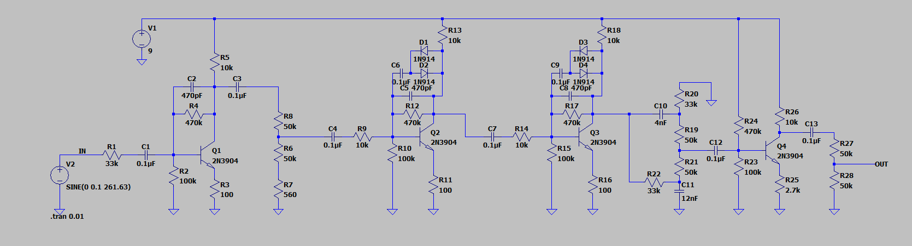
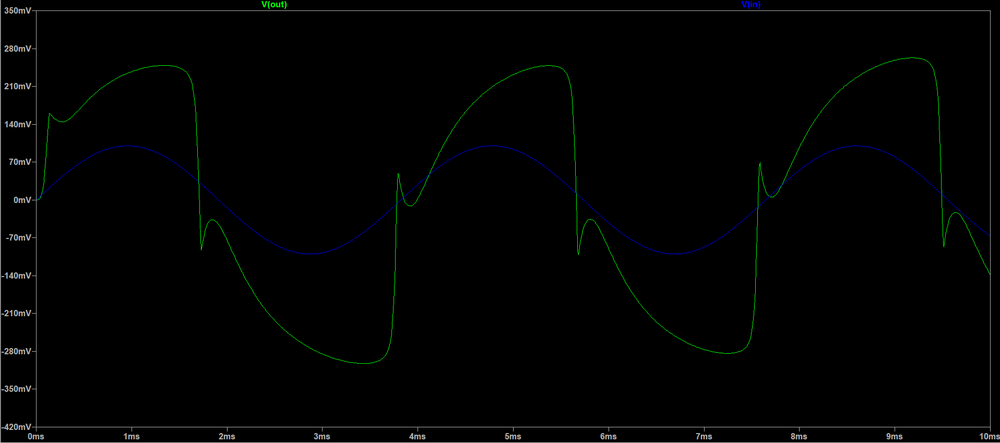

**Back to main page:** [Main](https://wmayfield.github.io/)

## 1: Distortion Guitar Pedal

I wanted to have a guitar pedal with distortion effects so I made one based off of a version of the Big Muff Pi pedal shown below. Some components are different due to supply, personal choice, and cost.

**LTspice Simulations:**

**Layout:**

**Final Product:**

No pedal, amp on overdrive:
[No Pedal](https://youtube.com/shorts/Tq4go4iENR0?feature=share)

Pedal used, amp on overdrive:
[Pedal](https://youtube.com/shorts/2BjB-fK5_Gs?feature=share)

**Reflection:**

**Back to main page:** [Main](https://wmayfield.github.io/)
