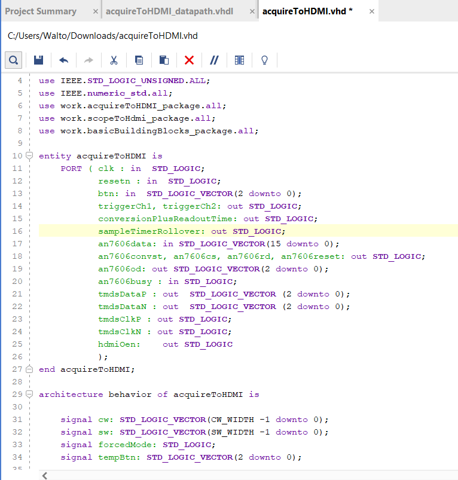

**Back to main page:** [Main](https://wmayfield.github.io/)

## Project 2: Oscilloscope

This project was completed in fall of my senior year (2025) through school. It consisted of creating an oscilloscope on a VHDL dev board with data acquisition, HDMI display, and trigger mode. I got the data acquisition and display to work perfectly, but had some issues with the way I was doing the trigger method, as it would stall the display incorrectly. I am not really supposed to provide the code as this is a course that still exists and I don't want to just give someone the answers, but I will provide videos of functionality and some snapshots of my code. This code doesn't really give anything away but shows the inputs and outputs as well as the usage of other files including trivial bits of code like muxes, comparators, registers etc.

[User button needed](https://youtube.com/shorts/P9OWi5cG0Po)
[Automatic Data Acquisition](https://youtube.com/shorts/16tT_uzRK_U)

### Reflection
This project was really good exposure to VHDL. I briefly started to learn VHDL at the end of my internship, but learning something is not the same as doing a project on it. Through this project, I learnt about the basics of VHDL like using a datapath and control approach, using IP blocks, and creating hierarchical code for ease of design and debugging. Additionally, coding something like an oscilloscope is useful because you start thinking about waveforms and registers which helps transition into signal processing ideas. Additionally, coding HDMI display could be useful in the future for a device needing some display.

**Back to main page:** [Main](https://wmayfield.github.io/)
