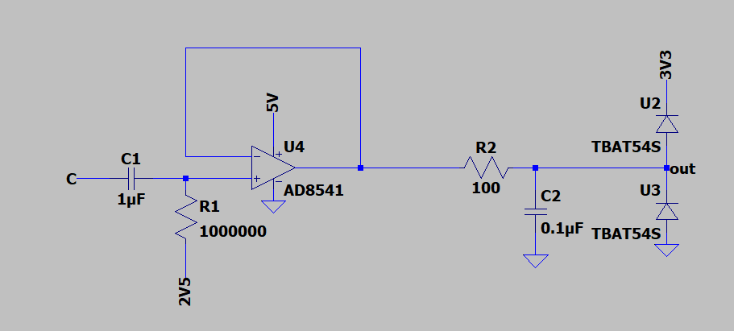
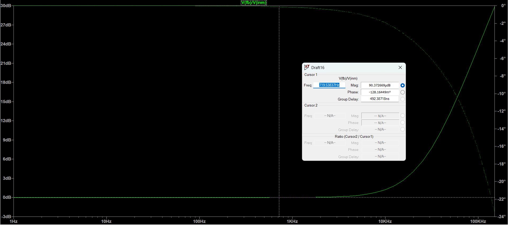
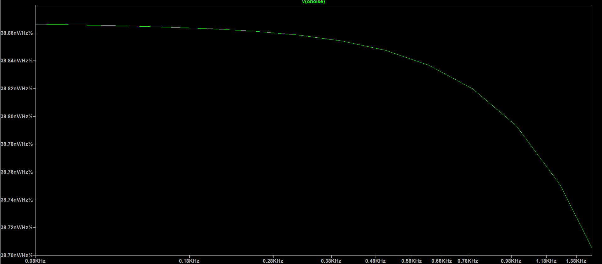
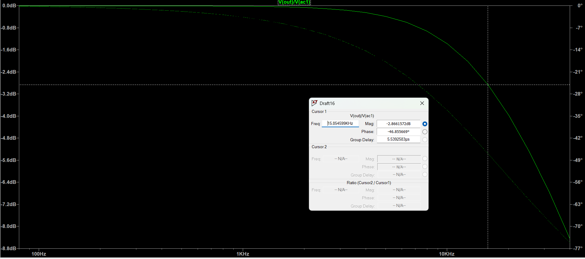
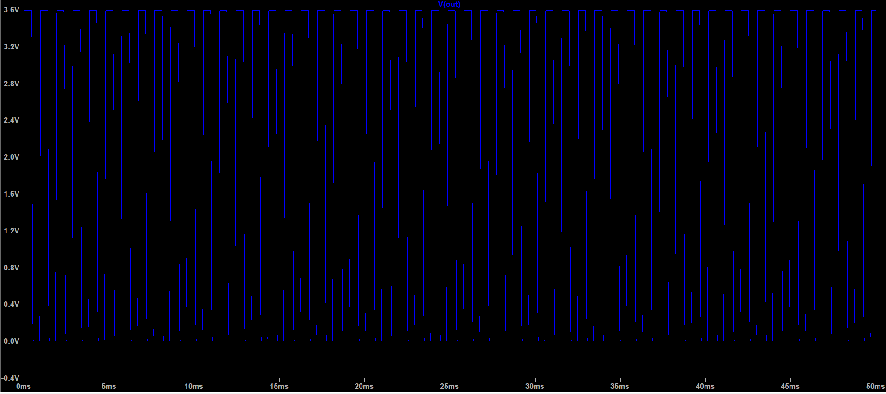

**Back to main page:** [Main](https://wmayfield.github.io/)

## Project 4: FPGA Pedal

So the idea here is to make a pedal that takes an input waveform directly from the guitar, inputs it into an FPGA for the user to do whatever they want, and then mix back in the new signal with the original with volume and mix control. For my purposes, I am not going to make this a marketable pedal with switches for bypass etc or make a metal enclosure because I am trying to save my money as a college student, however one day I hope to be able to add these things in and maybe even sell it. This project is also best for the electric guitar at its standard tuning notes as that is what I want to use it for. 

First, we have to get the analog inputs and outputs out of the way.
These should be AC coupled and for the input biased at some point between 0 and 3.3V. 2.5 is fine for now, we will see if 1.25V is not a big hassle to add later.

### Input circuit, stability, noise, frequency response, adc protection:

The design of this is based on minimal group delay, stability, and noise. There is an emphasis on group delay which we want to keep under [1ms](https://acris.aalto.fi/ws/portalfiles/portal/52513428/Audibility_of_Loudspeaker_Group_Delay_Characteristics_AAM.pdf) overall for inaudible delay in the range of 300Hz - 1kHz, and below 10ms for frequencies under 200Hz (Same link). The computing required by the FPGA can be neglected for now because the analog characteristics dominate the delay created by the FPGA.  

Lets look at the output mixing stage at different input notes, different gains on each mix, and different volumes. The tests performed will be Transient, AC, and noise sims.

[OutputGDSims](https://wmayfield.github.io/Prj4GDSims)  

[TransientSims](https://wmayfield.github.io/Prj4TransientSims)  

[NoiseSims](https://wmayfield.github.io/Prj4NoiseSims)  

## NOT DONE

**Back to main page:** [Main](https://wmayfield.github.io/)
