**Back to Project 4:** [Main](https://wmayfield.github.io/Prj4)

## Input circuit, stability, noise, frequency response, adc protection:  

### Input Circuit  
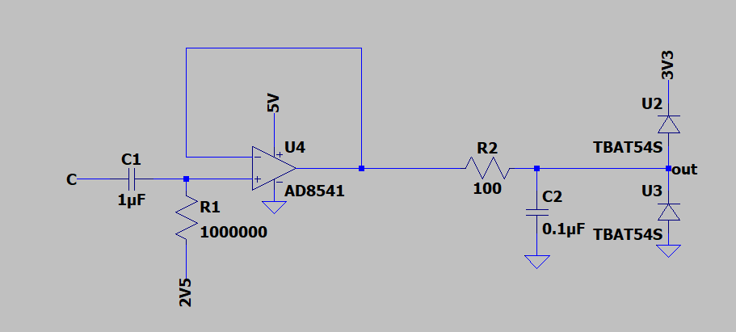  

## Buffer Stability Open Loop  
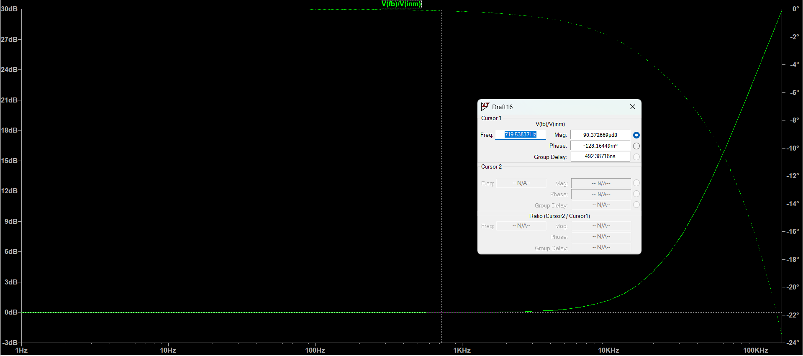  

## Input Noise  
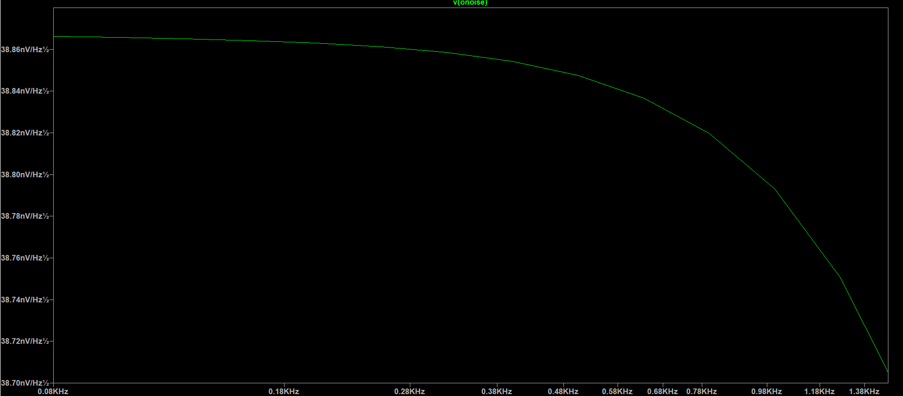  

## -3dB Sim  
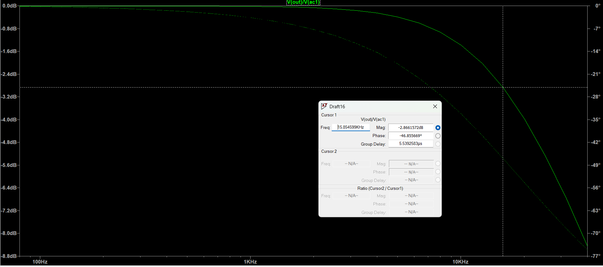  

## ADC Diode Protection  
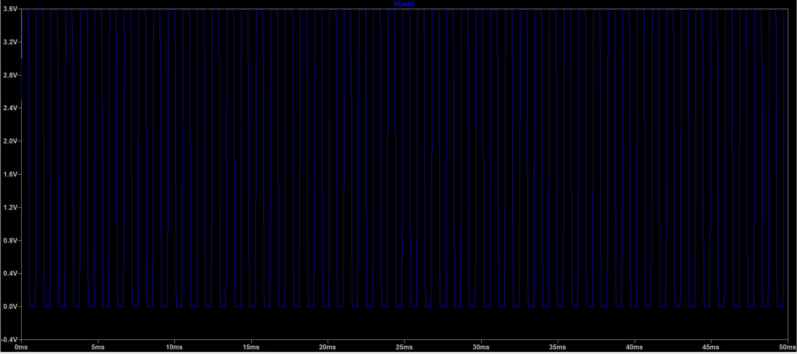  

## Output Mix Circuit, Stability, AC, Noise, Transient:  

### Output Circuit  
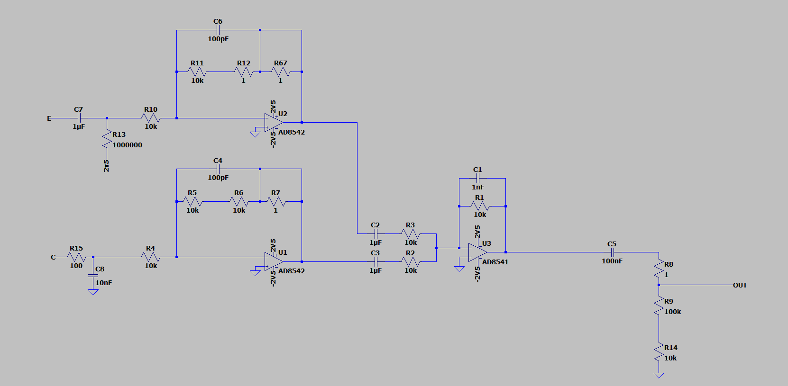  

### Simulations  
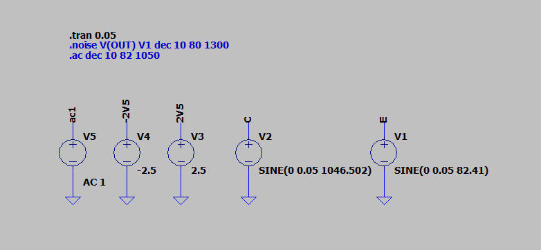  

### Stability of Output Mix Filter  
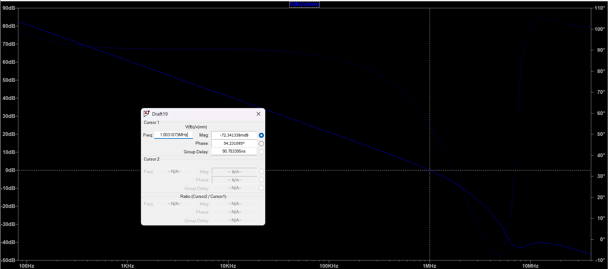  

### Stability Simulation Performed  
  

### Stability of FPGA Filter  
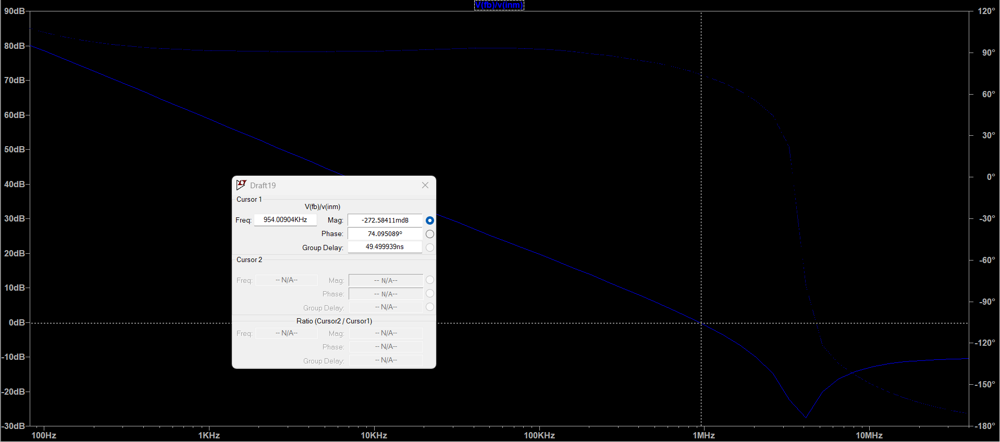  

### Stability Simulation Performed  
  

### Stability of Guitar Filter  
  

### Stability Simulation Performed  
  

### FPGA Output AC Analysis  
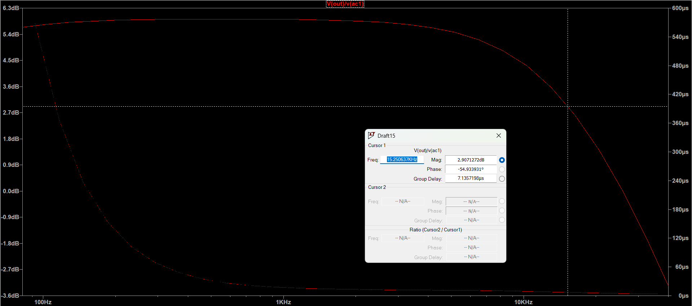  

### Guitar Output AC Analysis  
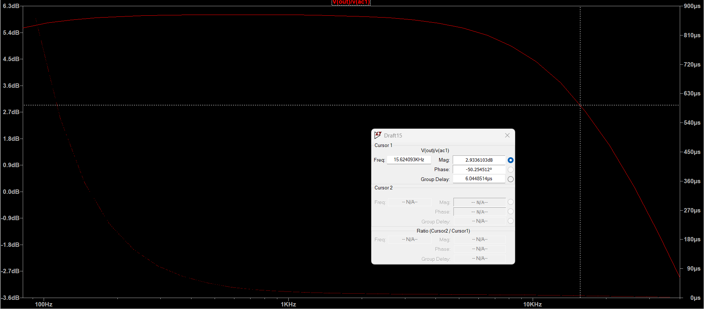  

### Worst Case Noise For Both FPGA and Guitar (Approx Same)  
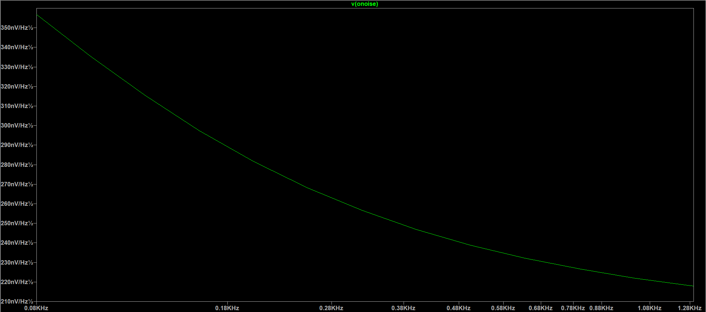  

### Transient Simulation  
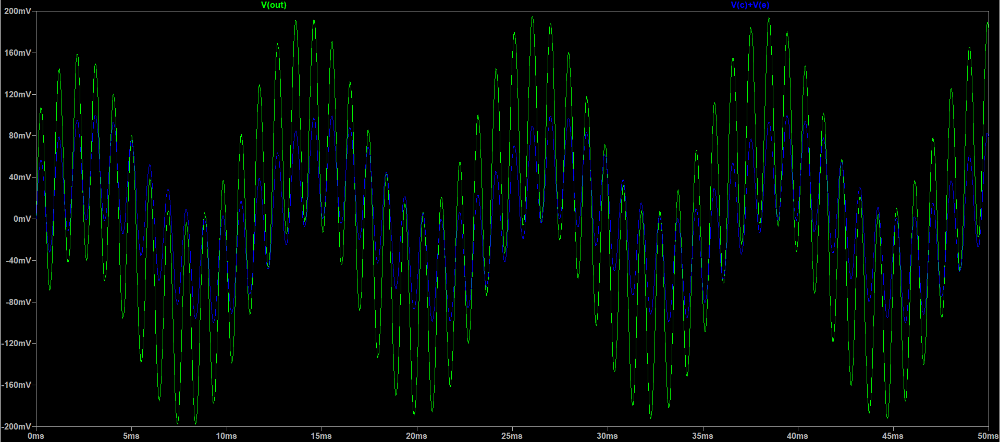  

**Back to Project 4:** [Main](https://wmayfield.github.io/Prj4)
