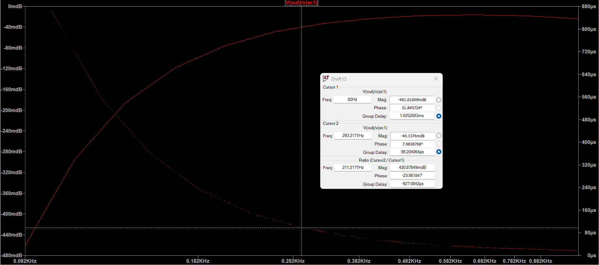
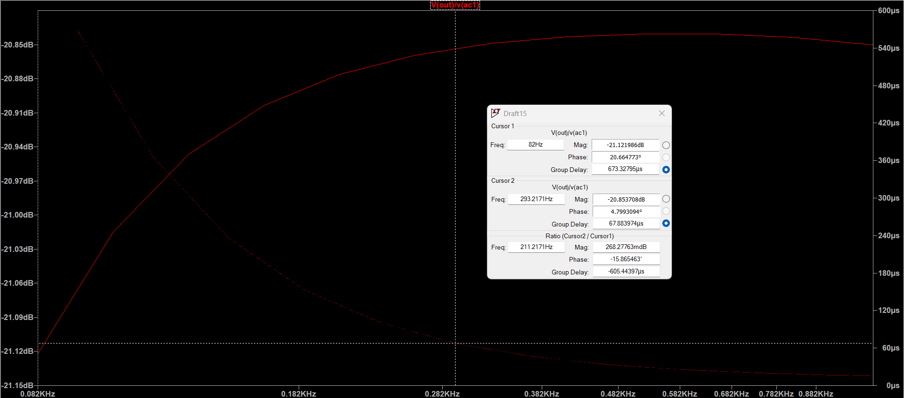
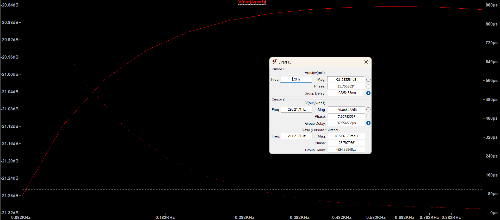
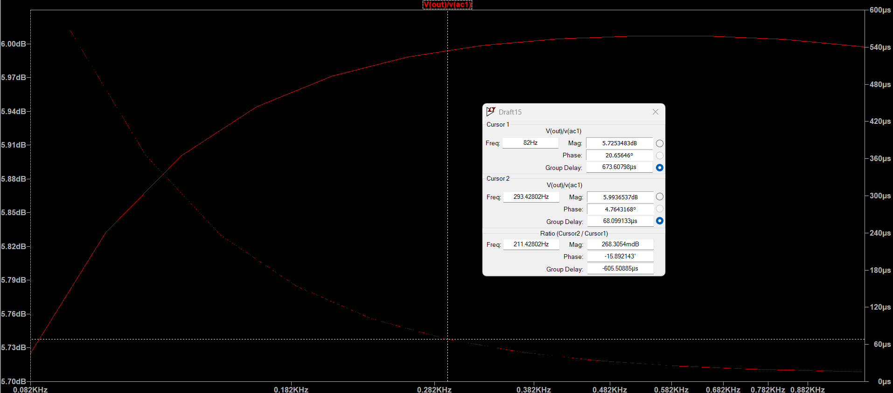
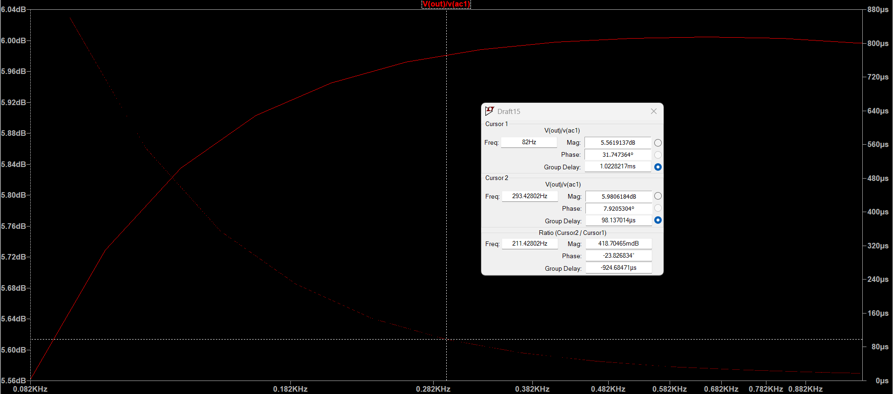
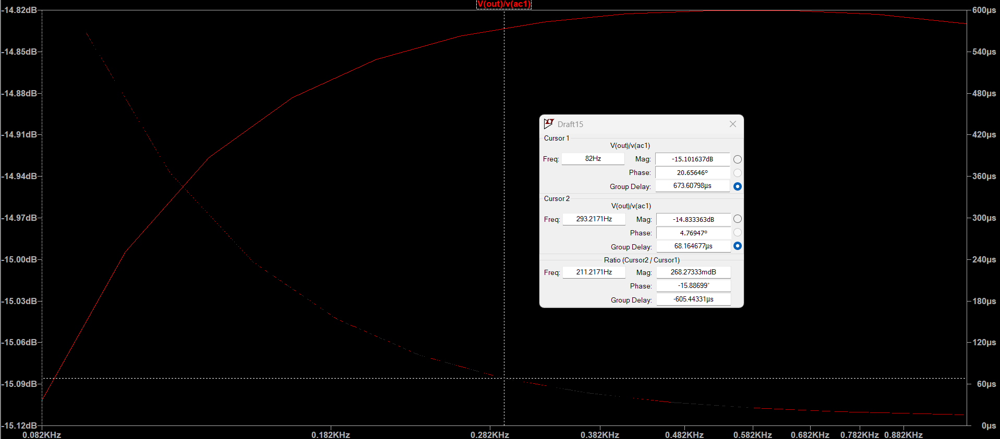
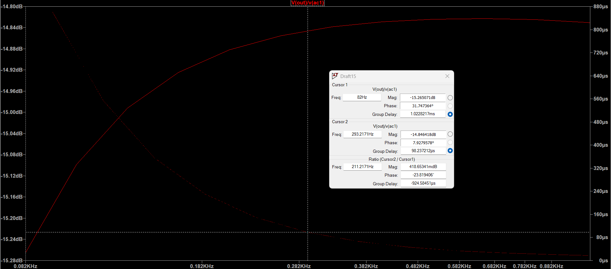

## Simulations

The following simulations are based on this circuit, with just the first op amp feedback resistors changing value for mix, and the final "potentiometer" values changing to model all edge cases. There is some attenuation at lower frequencies but its negligible for what I care about, and only 0.07 V off.

## Group delay and dB at unity gain and max volume, of FPGA input to mixer:  

## Group delay and dB at unity gain and max volume, of guitar input to mixer:  

## Group delay and dB at unity gain and lowest volume, of FPGA input to mixer:  

## Group delay and dB at unity gain and lowest volume, of guitar input to mixer:  

  

## Group delay and dB at x2 gain and max volume, of FPGA input to mixer:  

## Group delay and dB at x2 gain and max volume, of guitar input to mixer:  

## Group delay and dB at x2 gain and lowest volume, of FPGA input to mixer:  

## Group delay and dB at x2 gain and lowest volume, of guitar input to mixer:  

