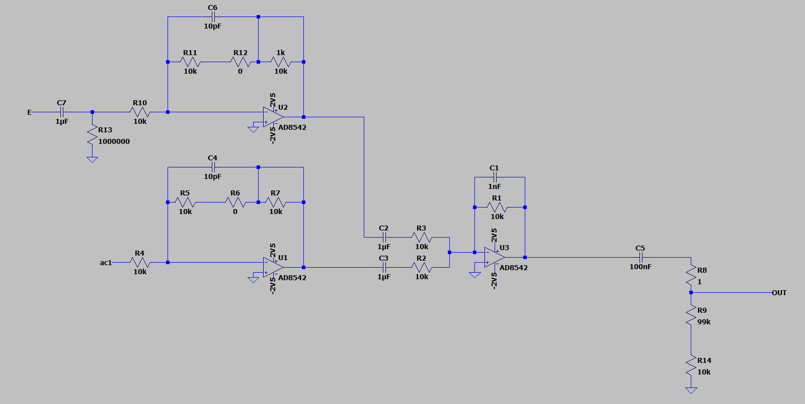
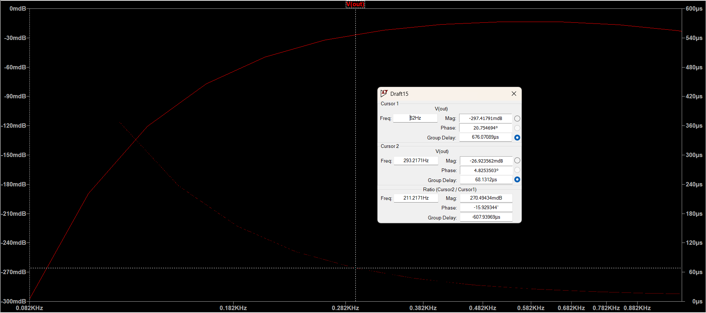

## Simulations

Group delay and dB at unity gain and max volume, of FPGA input to mixer:  

Group delay and dB at unity gain and max volume, of guitar input to mixer:  

Group delay and dB at unity gain and lowest volume, of FPGA input to mixer:  

Group delay and dB at unity gain and lowest volume, of guitar input to mixer:  

