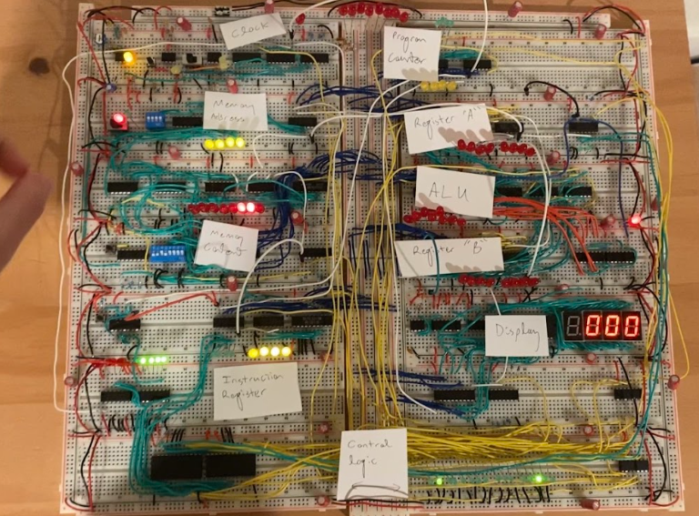

**Back to main page:** [Main](https://wmayfield.github.io/)

## Project 5: 8-Bit Computer

I did this project in the fall of my junior year. While I was not exactly recreating the wheel here and was watching youtube tutorials to create my CPU, I learnt a lot about how CPUs work, but more importantly I experienced the importance of power and signal integrity in a circuit as breadboards are not great for this. Here is a picture of my final design:

In the picture you can kind of make out the labels of the different sections, but I will just run through an overview of the design. The CPU contains a clock, program counter, memory addresses, programmable memory content, programmable instruction register, control logic, display, two registers, and an ALU for basic addition and subtraction. I programmed a multiplication algorithm to perform 6*7 (I know. I did this before it became a thing.) where we load the first value into the A register, and loop through subtracting 1 from this first value while incrementing our output by the second value until we reach the point to where the first value is 0 at which point we stop computing. This process is really annoying because you have to manually program the instructions yourself, and due to the terrible power distribution, some memory values kept resetting so it is kind of lucky I was able to get a multiplication process to run. I had to keep manually reprogramming the same instruction set for about 2 hours before it worked but here is the video of it working.

[CPU Mult](https://youtube.com/shorts/NXHKsxUq_Sk?feature=share)

At the start, you can see me showing you the values that we are multiplying in the red LEDs, which are 00000110 and 00000111.

### Small Reflection on Power and Signal Integrity
This was kind of my introduction into power and signal integrity, as there were problems with this the entier project. Breadboards are not good for daisy chaining power connections, and I experienced many cases where the input voltage into an IC was barely above the 4.3V cutoff, or sometimes lower than it. I could honestly barely solve this by providing power rails alongside all the boards and creating as many power connection contacts as possible, but eventually it worked. These flaws in power integrity as well as increased impedance in signal path due to it being on a breadboard caused this system to be extremely unreliable. Luckily I got to see it working eventually but this project really opened my eyes to the importance of PCBs and layout practices which I spent a lot of time learning after this project.

**Back to main page:** [Main](https://wmayfield.github.io/)
