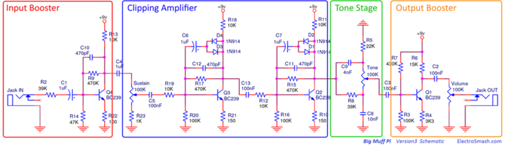
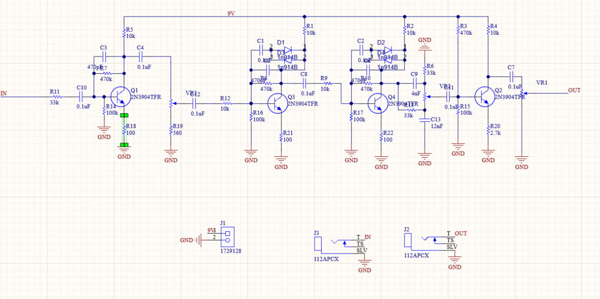
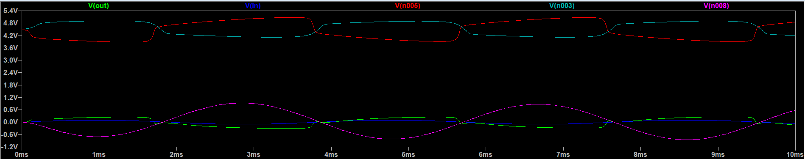
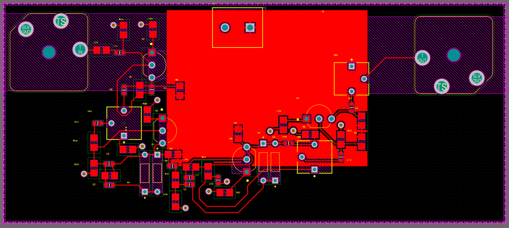

# My Projects

## 1: Distortion Guitar Pedal

I wanted to have a guitar pedal with distortion effects so I made one based off of the Big Muff Pi pedals shown below. Some components are different due to supply, personal choice, and cost.

#LTspice Simulations

#Layout:

#Final Product

No pedal, amp on overdrive:
https://youtube.com/shorts/Tq4go4iENR0?feature=share

Pedal used, amp on overdrive:
https://youtube.com/shorts/2BjB-fK5_Gs?feature=share

